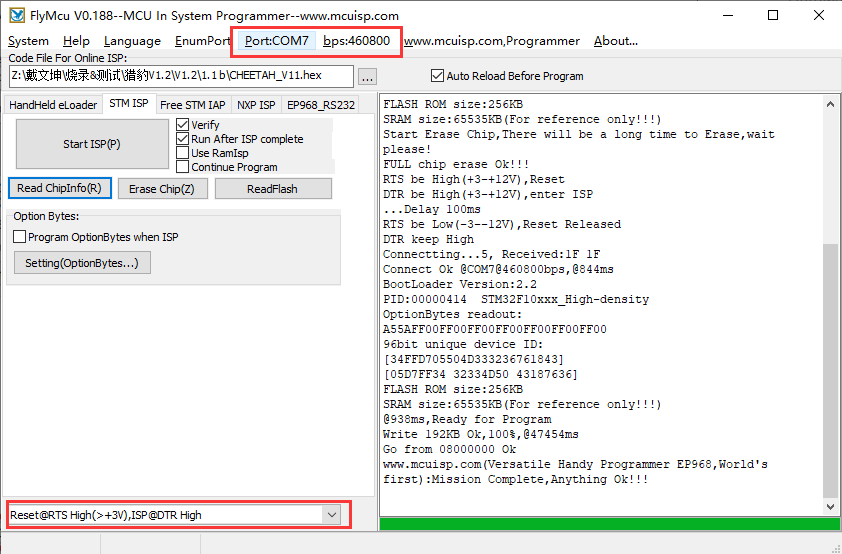
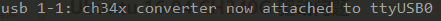

# Bootloader-STM32F103
This is the bootloader for STM32F103 chips.

# Usage

## Build bootloader

This project uses KEIL software to build the project.  Open Stm32f103Bootloader.uvproj file in Bootloader-STM32F103\Bootloader-STM32F103\PROJ and click the build button. After build , you can get the bootloader file ```Bootloader-STM32F103\OUTPUT\Bootloader-STM32F103.hex```

## Upload bootloader

You can use the bootloader hex you build or use the pre-build hex file in the OUTPUT folder.

You can use SWD , serial or USB cable. And if you are using our [Cheetah](https://github.com/FYSETC/FYSETC-Cheetah) or [AIO_II](https://github.com/FYSETC/FYSETC-AIO_II) boards , you can upload it with the STM32Flasher software which only work in Windows.

### Option 1: Upload the bootloader(windows)

There is bootloader file name ```Stm32f103Bootloader.hex``` beside this README file.

Download the flash software in our github https://github.com/FYSETC/STM32Flasher

Power the board with power supply and connect the board to your PC with USB cable (This step should before you open the software)

Double the click "FlyMcu.exe" software and open ```Bootloader-STM32F103.hex``` file.




Select "Reset@DTR low(<-3v),ISP @RTS High"

Click "Port" to select the port of your USB 

Select Bootloader-STM32F103\OUTPUT\Bootloader-STM32F103.hex in the ''Code File For Online ISP:'' Editbox..

At last , "Start ISP(p)" to upload the firmware.

### Option2 : Upload the bootloader(linux)

#### Load usb driver

Delete the old version driver /lib/modules/$(uname -r)/kernel/drivers/usb/serial/ch341.ko

```
rm /lib/modules/$(uname -r)/kernel/drivers/usb/serial/ch341.ko
```

Download the CH34x driver(linux version) from our github

https://github.com/FYSETC/CH340-Driver

follow the readme.txt to make and load the driver .

If you want the driver load automatically every time your PC power up. You can copy the ch34x.ko file to 

directory /lib/modules/$(uname -r)/kernel/drivers/usb/serial/ , and do

```
depmod 
```

#### Install stm32flash tool

First get the code

```
git clone https://git.code.sf.net/p/stm32flash/code stm32flash-code
```

Then follow the INSTALL file to install the software

#### Upload the bootloader

Connect the motherboard with USB cable and your PC. And do

```
dmesg
```

And you will get message like 



the ttyUSB0 is the port to communicate with the motherboard.

And then go the the firmware.hex file location directory and do the follow command to upload the firmware

```
 stm32flash -w Bootloader-STM32F103.hex -v -i rts,-dtr /dev/ttyUSB0
```

## Rebuild firmware(Marlin)

This bootloader default boot address is 0x8010000 , so if you want to use this bootloader you need to change the firmware(I think you use Marlin, also you can use other firmware) flash address to 0x8010000.

And if you are using our stm32f103 boards([AIO_II](https://github.com/FYSETC/FYSETC-AIO_II) or [Cheetah](https://github.com/FYSETC/FYSETC-Cheetah)) . You need to add the following lines to the file "Marlin\Marlin\buildroot\share\PlatformIO\scripts\fysetc_STM32F1.py" (or check Marlin PR: https://github.com/MarlinFirmware/Marlin/pull/18179)

```
# Relocate firmware from 0x08000000 to 0x08010000
for define in env['CPPDEFINES']:
    if define[0] == "VECT_TAB_ADDR":
        env['CPPDEFINES'].remove(define)
env['CPPDEFINES'].append(("VECT_TAB_ADDR", "0x08010000"))

custom_ld_script = os.path.abspath("buildroot/share/PlatformIO/ldscripts/fysetc_stm32f103rc.ld")
for i, flag in enumerate(env["LINKFLAGS"]):
    if "-Wl,-T" in flag:
        env["LINKFLAGS"][i] = "-Wl,-T" + custom_ld_script
    elif flag == "-T":
        env["LINKFLAGS"][i + 1] = custom_ld_script
```

You can add it after the line 

```
Import("env")
```

And then rebuild the 3d printer firmware.

## Upload firmware(Marlin) with sdcard

After you upload the bootloader and rebuild the firmware(Marlin), now you can upload it to the board with sdcard

1. Copy the firmware(Marlin) to the SD card , you need to be sure the firmware name is "firmware.bin". 
2. And then power off the machine.
3. Insert the SD card to the board.
4. Power on the machine. 
5. And wait for 10~20 seconds , it will be done. 

You can connect the usb cable to monitor the process.

## Change the bootloader flash address

This bootloader default boot address is 0x8010000, but also you can change it too.

First , the size of bootloader need at least `32k` , so the user-defined flash size need to be larger than `0x8008000` ,You need to modify firmware(Marlin) and this Bootloader 

### Firmware(Marlin):

Change following `0x08010000` to your address. It's in `STM32F103RC_fysetc.py` file

```
env['CPPDEFINES'].append(("VECT_TAB_ADDR", "0x08010000"))
```

And change following `64K` to your address corresponding size. It's in `fysetc_stm32f103rc.ld` file

```
rom (rx) : ORIGIN = 0x08010000, LENGTH = 256K - 64K
```

***note : 64K is for 0x10000, as 1K==1024==0x400*** 

### Bootloader:

Change following `0x08010000` to your address,  it's in `Bootloader-STM32F103/CODE/APP/bootloaders.h` file

```
 #define BOOTLOADER_FLASH_ADDR   ( 0x08010000 )
```

### Example:

You want to change flash address to `0x8008000`, `so 0x8000 / 0x400 =32`, so all lines need to change are

```
env['CPPDEFINES'].append(("VECT_TAB_ADDR", "0x08008000"))

rom (rx) : ORIGIN = 0x08008000, LENGTH = 256K - 32K

#define BOOTLOADER_FLASH_ADDR   ( 0x08008000 )
```

# Issues

And the moment , according to the test , this firmware is not stable. And some SD card will fail all the time , but some will succeed , so if it fail (you can monitor it from USB  (UART) ) , change another SD card and try again. And welcome to give us your improvement ideas.